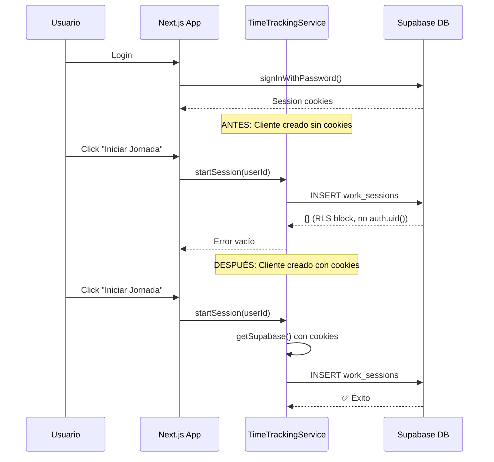

# Walkthrough: Auditoría y Explicación del Bug "Iniciar Jornada"

## 🐛 El Bug: ¿Qué Pasaba?
Al hacer clic en **"Iniciar Jornada"**, la aplicación mostraba:
```
Error detail: {}
Critical Error in startSession: {}
```
Un objeto vacío `{}` sin ningún mensaje de error útil.

---

## 🔍 Causa Raíz

El problema estaba en cómo se creaba el **cliente de Supabase** en el archivo [time-tracking.service.ts](file:///c:/Users/HP/.gemini/antigravity/scratch/mini-proyecto-colaborativo-local/control-horario-app/src/services/time-tracking.service.ts).

### Código Problemático (Antes)
```typescript
import { createClient } from '@/lib/supabase/client';

const supabase = createClient(); // ❌ Se crea UNA VEZ cuando el módulo se carga

export const TimeTrackingService = {
    async startSession(userId: string) {
        // Usa el cliente "stale" que no tiene cookies de auth
        const { data, error } = await supabase.from('work_sessions').insert(...);
    }
}
```

### ¿Por Qué Fallaba?
1. **Timing incorrecto**: El cliente se creaba cuando JavaScript cargaba el módulo, **antes** de que el usuario completara el login.
2. **Sin contexto de autenticación**: Las cookies de sesión de Supabase no estaban disponibles en ese momento.
3. **RLS Silencioso**: Las políticas de Row Level Security (RLS) en Supabase bloqueaban las operaciones porque `auth.uid()` era `null`.
4. **Error vacío**: Supabase devuelve `{}` cuando RLS bloquea una operación sin generar un error explícito.

### Código Corregido (Después)
```typescript
function getSupabase() {
    return createClient(); // ✅ Cliente fresco cada vez
}

export const TimeTrackingService = {
    async startSession(userId: string) {
        const supabase = getSupabase(); // ✅ Tiene las cookies actuales
        // Ahora auth.uid() funciona correctamente
    }
}
```

---

## 📊 Diagrama del Flujo



---

## 🧹 Auditoría del Proyecto

### Código Innecesario Detectado

| Archivo | Elemento | Razón |
|---------|----------|-------|
| [types/index.ts](file:///c:/Users/HP/.gemini/antigravity/scratch/mini-proyecto-colaborativo-local/control-horario-app/src/types/index.ts) | `Company` interface | No se usa en ningún componente |
| [types/index.ts](file:///c:/Users/HP/.gemini/antigravity/scratch/mini-proyecto-colaborativo-local/control-horario-app/src/types/index.ts) | `User` interface | No se usa en ningún componente |
| [types/index.ts](file:///c:/Users/HP/.gemini/antigravity/scratch/mini-proyecto-colaborativo-local/control-horario-app/src/types/index.ts) | `UserRole` type | Solo definido, nunca importado |
| [lib/supabase/server.ts](file:///c:/Users/HP/.gemini/antigravity/scratch/mini-proyecto-colaborativo-local/control-horario-app/src/lib/supabase/server.ts) | Función `createClient` (server) | No se usa actualmente (para Server Components) |

> [!TIP]
> Estos tipos pueden mantenerse para uso futuro (ej: panel de admin), pero si quieres reducir el código, se pueden eliminar.

### Estado Actual ✅

- **Imports rotos**: Todos corregidos (ya no existe `@/lib/supabase` genérico)
- **Cliente Supabase**: Creación por llamada en todos los métodos del servicio
- **Error handling**: Mejorado con JSON.stringify y mensajes legibles
- **Debug logging**: Agregado para facilitar diagnóstico futuro

---

## 📁 Archivos Modificados

| Archivo | Cambio |
|---------|--------|
| [time-tracking.service.ts](file:///c:/Users/HP/.gemini/antigravity/scratch/mini-proyecto-colaborativo-local/control-horario-app/src/services/time-tracking.service.ts) | Refactorizado cliente Supabase + logging |
| [DashboardClient.tsx](file:///c:/Users/HP/.gemini/antigravity/scratch/mini-proyecto-colaborativo-local/control-horario-app/src/app/dashboard/DashboardClient.tsx) | Corregido import `@/lib/supabase/client` |
| [Timer.tsx](file:///c:/Users/HP/.gemini/antigravity/scratch/mini-proyecto-colaborativo-local/control-horario-app/src/features/timer/Timer.tsx) | Corregido import `@/lib/supabase/client` |
| [register/page.tsx](file:///c:/Users/HP/.gemini/antigravity/scratch/mini-proyecto-colaborativo-local/control-horario-app/src/app/register/page.tsx) | Corregido import `@/lib/supabase/client` |

---

## ✅ Verificación Final

La aplicación ahora debería:
1. Mostrar el dashboard correctamente
2. Permitir iniciar una jornada sin errores
3. Mostrar mensajes de error legibles si algo falla
